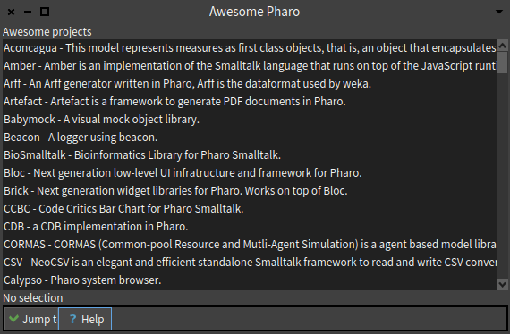

# AwesomePharoPresenter

A small UI that list the awesome Pharo projects, found [here](https://github.com/pharo-open-documentation/awesome-pharo)

Here is a screenshot:


You can load it using:

```Smalltalk
Metacello new
    baseline: 'AwesomePharo';
    repository: 'github://bergel/AwesomePharoPresenter/src';
    load.
```   

In the Tools menu you will see an item `Awesome Pharo`
